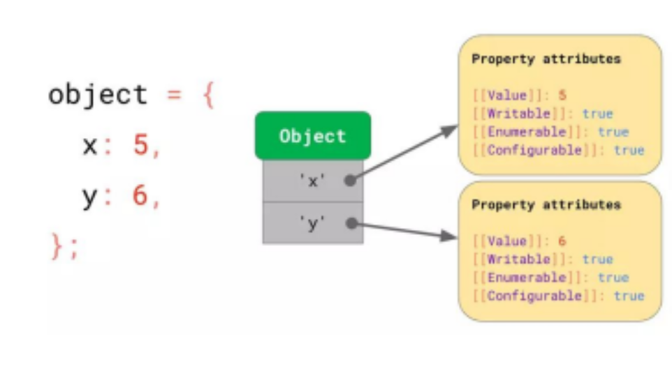

# Convention = quy tắc
1. **Ưu điểm**
- Code theo format chung, dễ nhìn
- Người khác trong team dễ,đọc code
2. **Một số convention phổ biến:**
- snake_case: tạm thời không dùng
- kebab-case: đặt tên file và folder
- camelCase: đặt tên biến, hàm
- PascalCase: đặt tên class
# Javascript
1. **Dùng console.log nâng cao**
- console.log with ‘ and “
- Formatted console.log\
    console.log('Toi la Nga');
    console.log("Toi la Phong");
    console.log(`${variable_name}`)\
    e.g: 
    const myName = 'Ngoc My';\
    console.log("Xin Chào" + myName);\
    console.log(`Xin Chào ${myName}`);\
    let name = "Nga";
    console.log(`Toi la ${name}`);
    console.log("Toi ten la" + name + "")
2. **Object**
- Là một trong những kiểu dữ liệu quan trọng nhất trong JavaScript, dùng để lưu trữ dữ liệu dạng key-value.

e.g: 
- **Cú pháp: Object = đối tượng, dùng để lưu trữ tập hợp các giá trị vào cùng một biến hoặc hằng số**
● <key>: giống quy tắc đặt tên biến\
● <value>: có kiểu giống biến,hoặc là 1 object khác.\       
    const/let <variable_name> = {
    key1: value1,
    key2: value2,
    }
- Khai báo:
    const product = {
        "name": "Laptop",
        "price": 500,
        "isWindow": true,
        "manufacturer": {
            "name": "Acer",
            "year": 2024,
        }
    };
- Sử dụng : \
    console.log(product.manufacturer.name);\
    console.log(product.manufacturer.year);\
    console.log(product.name);\
- Gán lại :\
    product.manufacturer.year = 2026;\
    console.log(product.manufacturer.year);
3. **Logical operator**
- && : cả 2 vế của mệnh đề đều đúng
- || : một trong 2 vế đúng
- ! : đảo ngược lại giá trị của mệnh đề
4. **Array: mảng**\
**Tạo mảng:**
- Khai báo
- Sử dụng\
**Truy xuất mảng:**
- Độ dài mảng: length
- Lấy phần tử theo index:[0], [1], [2]
- Lấy phần tử theo vị trí : [1], [2], [3]\
E.g : 
// Khai báo 1 mảng giá các cổ phiếu (10 cổ phiếu, kiểu số: 1$ -> 200$)\
const coPhieu = [10, 25, 40, 55, 70, 90, 110, 135, 160, 190];\
// In ra giá cổ phiếu vị trí số 2, 4, 6\
console.log(coPhieu[1]);\
console.log(coPhieu[3]);\
console.log(coPhieu[5]);\
5. **Function**
- Function = hàm, là đoạn code được đặt tên và có thể tái sử dụng, thực hiện 1 nhiệm vụ hoặc 1 tính toán cụ thể.
- Khai báo:
    function <nameFunction>() {
    // code
    }
- Parameter
- Return value\
e.g:\
function sayHelloTime() {\
    console.log("Myttn");\
    console.log("Myttn");\
    console.log("Myttn");\
}\
sayHelloTime();\

//  truyển tham số\
function sum(a, b) {\
    console.log(a + b);\
    return a + b;\
}\

function subTract(a, b) {\
    console.log(a - b);\
}
sum(10, 20);\
sum(1, 5);\
//  truyền thiếu tham số\
sum(1);\
const total = sum(10, 20);\
console.log(total);\